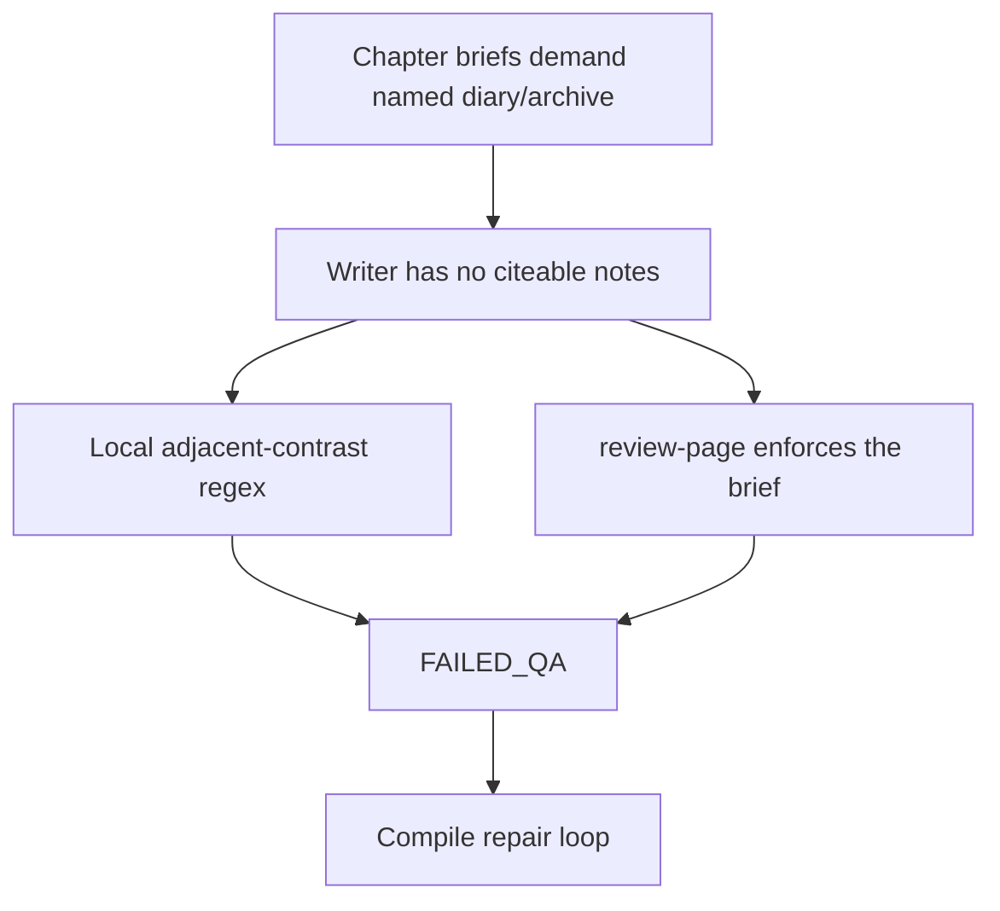

# Fix QA false positives

The last Balanced run (*Wars That Shaped the Modern World*) left 22 `FAILED_QA` pages and then spent the compile “final read-through” rewriting them serially. Three shapes were false or unsatisfiable. Real defects (invented magistrate scene, Haradinaj ICTY sequence, adjacent-page repetition) stay hard fails.



Do **not** change the 75-point model-score cliff, the Generation quality gates screen, or this in-flight compile. Saves affect calls started afterward.

## 1. Local adjacent-contrast: drop the `not` + `It` + `evidence` branch

The intended tell is still the first arm of [`hasFormulaicAdjacentContrast`](packages/core/src/generation/pagesLocalQa.ts): rhetorical setup (`you have been taught`, `but what if`, …) then a sweeping contrast that names a thesis word. The existing fixture in [`pages.test.ts`](packages/core/src/generation/pages.test.ts) (`"You have been taught…"` / `"But what if the original pattern…"`) covers that arm.

The second arm is the false positive:

```870:871:packages/core/src/generation/pagesLocalQa.ts
const BROAD_NEGATION_PATTERN = /\b(?:not|never|opposite|absent|wrong|misread|misunderstood|been taught)\b/i;
const THESIS_SENTENCE_START_PATTERN = /^(?:this|that|it|the truth|therefore|thus|instead)\b/i;
```

Any sentence containing `not`, followed by one starting `It`/`This` that also contains `evidence`/`truth`/…, rejects the page before the model reviewer runs. Page 136’s actual pair:

> …does **not** identify the publication or exact date. **It** therefore offers limited **evidence**: …

That is honest sourcing hedge after the reviewer demanded a citation. Delete the second arm (or require a real rhetorical setup on the first sentence — never a bare `not`). Keep `hasFormulaicContrastOveruse` (`not just X, it's Y`) unchanged; [`pagesLocalQa.test.ts`](packages/core/src/generation/pagesLocalQa.test.ts) already pins that separately.

Add a local-QA fixture that is the Ogoja hedge (or a stripped copy of it) and must **approve**. Put it next to the contrast-formula cases in `pagesLocalQa.test.ts`, not only in the async `pages.test.ts` reviewer suite — local QA is the seam that fired.

## 2. One citation contract: no named source without citeable notes

[`GROUNDED_FACTUALITY_RULE`](packages/core/src/generation/pagesShared.ts) is correct and stays: never invent studies, journals, experts, citations. The bug is the **other** demand: briefs and the reviewer requiring a named diary/dispatch/archive the writer was never given.

[`hasReaderFacingSources`](packages/core/src/generation/markdown.ts) already treats a URL-less “Gemini grounded summary” as not a source. This book had exactly one such row; [`loadResearchNotesForGeneration`](apps/worker/src/generation/generationContext.ts) still forwarded it as `title: summary`. Chapter briefs never even see `researchNotes` ([`GenerateChapterBriefOptions`](packages/core/src/generation/pagesPageMap.ts) has no such field), so the brief model invents “documented testimony” from the premise (*carefully sourced*) and [`reviewPageDraft`](packages/core/src/generation/pagesReview.ts) then says “Evaluate only the current pageBrief.”

Put a small `citationContractFields(researchNotes)` next to `GROUNDED_FACTUALITY_RULE` in `pagesShared.ts` (same shape as the opening contract: rules fused to payload, so a prompt cannot state the ban without the gate). Empty / non-citeable notes → “assign people, places, dates; do **not** require a diary, dispatch, archive, or named testimony the researchNotes list does not contain.” Non-empty citeable notes → keep today’s “use provided researchNotes” line.

Citeable means the same thing the Sources list already uses: a note that came from a row `hasReaderFacingSources` would keep. Filter in [`loadResearchNotesForGeneration`](apps/worker/src/generation/generationContext.ts) (drop URL-less bootstrap rows) so core can keep taking `string[]` and treat “empty list” as the gate. Do not match the title `"Gemini grounded summary"` as a special case; the URL rule already covers it ([`markdownSources.test.ts`](packages/core/src/generation/markdownSources.test.ts)).

Thread the contract into:

- [`generateChapterBrief`](packages/core/src/generation/pagesPageMap.ts) / whole-book page map / [`repairPageBrief`](packages/core/src/generation/pagesPageMap.ts) — pass `plan.researchNotes` (or the filtered generation notes) in the user payload and spread `citationContractFields(…).rules`.
- Writer: [`buildPageDraftSystemContent`](packages/core/src/generation/pageDraftMessages.ts) already has `GROUNDED_FACTUALITY_RULE`; add the contract so a brief that still says “name the archive” is overridden when notes are empty.
- Reviewer and reviser in [`pagesReview.ts`](packages/core/src/generation/pagesReview.ts): **do not reject for missing archive identity when researchNotes is empty.** Still reject invented named sources, fabricated scenes (page 22’s unnamed county magistrate), and factual howlers (page 190).

Measure it the way the opening contract is measured: [`pagesShared.test.ts`](packages/core/src/generation/pagesShared.test.ts) set-identity over brief + writer + reviewer prompts, empty notes vs notes with a URL.

`repairPageBrief` already may “discard original required … sources” when QA says they cause repetition; extend that to “discard source-identity requirements when researchNotes is empty,” so a compile that still hits a stored bad brief can re-assign the page without asking for an archive.

## 3. Compile repair: do not replay unsatisfiable citation fails

[`compileExport.ts`](apps/worker/src/handlers/compileExport.ts) always unions `failedQaPageIndexes` into [`repairPagesFromFinalQa`](apps/worker/src/handlers/compileExportRepair.ts). That is why 22 pages, none of which could grow a citation, each got revise → review → brief-repair → more revises (~1 minute each) while the UI said “Doing a final read-through.”

After (2), new drafts should not land in this bucket. The compile still has to behave for books whose briefs and `FAILED_QA` reports already exist.

Add a **tested** predicate (core, next to the citation contract) over the stored `Page.qualityReport`:

- Skip repair when there are **no citeable notes** and **every** issue is a source-identity complaint (pageBrief required a named testimony/archive/citation that was not identified).
- **Do not skip** invented-scene, factual-error, repetition, overpack, placeholder, or prompt-leak issues — including when they appear on the same page as a source complaint. If any issue is repairable, the page stays in the set.

Drive that off issue text with a small explicit pattern list, pinned to the actual sentences from this run (e.g. “despite the page brief explicitly requiring”, “no specific dispatch date”, “documented civilian”). Do not invent a new `PageQualityReport` code enum in this pass; a code field would be the right long-term seam but it would not classify the 22 reports already stored.

Wire it where `extraPageIndexes` is built (FAILED_QA union), not by shrinking `extractRepairPageIndexes` of a final-QA verdict that named a real manuscript problem.

After the adjacent-contrast regex fix, a local-only “generic AI-rhetorical pattern” report should no longer appear. Optionally skip repair when `notes` is `"Local quality checks rejected the page."` and the only issue is that contrast line — belt and braces, same test file.

Keep exporting the best draft as `FAILED_QA` when a skipped page was already flagged; the quality card should still show the citation warning. Skipping repair must not flip those pages to `COMPLETED`.

## Tests (the regression surface)

- `pagesLocalQa.test.ts`: Ogoja-style hedge approves; the `You have been taught` / `not just X, it's Y` cases still fail.
- `pagesShared.test.ts`: citation-contract set identity on brief, writer, reviewer.
- `pagesReview.test.ts`: empty `researchNotes` + a brief that demands a diary → approve if the prose is otherwise sound; invented named journal still rejects.
- `pagesPageMap.test.ts` / chapter-brief capture: empty notes → system text forbids requiring a named archive.
- `compileExportQuality.test.ts`: FAILED_QA whose only issues are source-identity + empty research → `repairPagesFromFinalQa` does not call revise; a mixed page (source + repetition) still repairs; invented-scene still repairs.

## Out of scope

- Raising or removing the `score >= 75` gate in [`pagesReview.ts`](packages/core/src/generation/pagesReview.ts) (eight pages failed at 72; that is a bar change, not a false-positive classifier).
- Generation quality gates (those extras were already off on this compile).
- Killing the in-flight compile or rewriting this book’s stored briefs by hand.
