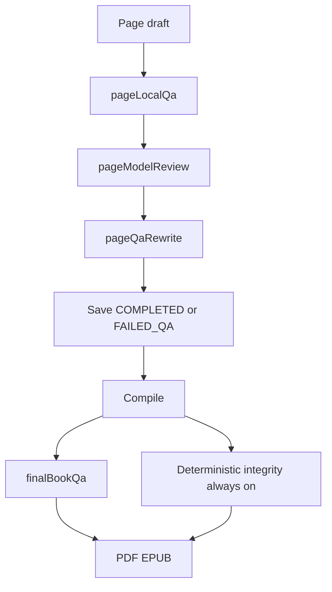

# Optional pipeline QA gates

The Quality tab only toggles extras ([`QUALITY_FEATURE_IDS`](packages/core/src/generation/qualityGates.ts)). Page local QA, `review-page`, the rewrite loop, and compile final review always run. That is why emptying Balanced still spent ~15 minutes on “Doing a final read-through.”

Keep the existing seam: one id per row, `quality.enabled(id)` in the worker, missing keys fall back to compiled defaults. Do not invent a second gate system. Do not import quality-gate settings into core’s reviewer implementations.



## New feature ids

Prepend these to [`QUALITY_FEATURE_IDS`](packages/core/src/generation/qualityGates.ts) so they render at the top of the screen. Defaults: **all four Effort tiers on** — same as today’s always-on behaviour.

- **`pageLocalQa`** — Deterministic local page checks ([`runLocalPageQualityChecks`](packages/core/src/generation/pagesLocalQa.ts)): adjacent-contrast, placeholders, prompt leak, fabricated-research phrasing, dash overuse, etc. Also gates [`runLocalFinalQa`](packages/core/src/generation/pagesLocalQa.ts) inside compile’s whole-book QA, or that pass would still reject the book with the same regexes.
- **`pageModelReview`** — The `review-page` model call ([`reviewPageDraft`](packages/core/src/generation/pagesReview.ts)).
- **`pageQaRewrite`** — Revise / re-review / brief-repair loop ([`runPageQualityLoop`](apps/worker/src/generation/pageReview.ts)). Off means at most one review; a failing page ships as `FAILED_QA` with no extra model calls.
- **`finalBookQa`** — Compile chapter-transition review, `final-book-qa`, and [`repairPagesFromFinalQa`](apps/worker/src/handlers/compileExportRepair.ts) (including the `FAILED_QA` union). Off must win over both `mediaSettings.finalReview` and the **parallel-wave force** in [`compileExport.ts`](apps/worker/src/handlers/compileExport.ts) lines 211–216 — that force is why a book-level uncheck never stopped this pass.

Add matching entries to `QUALITY_FEATURE_DEFAULTS` and `QUALITY_FEATURES` (label + summary). Pin `QUALITY_FEATURES.map(f => f.id)` equal to `QUALITY_FEATURE_IDS` in [`qualityGates.test.ts`](packages/core/src/generation/qualityGates.test.ts) so a new id cannot ship without a row.

**Leave always on:** [`runDeterministicManuscriptChecks`](packages/core/src/generation/manuscriptQuality.ts) (missing pages, index gaps, empty manuscript). Those are publication integrity, not quality extras.

**Per-book `finalReview`:** keep it. Final compile QA runs only when `finalBookQa` is on **and** (`mediaSettings.finalReview` **or** parallel-page waves). Gate off → never.

**Stored revisions after deploy:** `parseQualityFeatureSettings` fills missing keys from defaults, so a revision that already emptied Balanced will still turn these four **on** for Balanced until the operator unchecks the new rows and saves. That is the existing merge contract ([`adminGenerationQuality.ts`](apps/api/src/routes/adminGenerationQuality.ts)); do not special-case it.

The console already renders whatever ids the server sends ([`featureRows`](apps/web/src/features/admin/GenerationQualityScreen.tsx)). OpenAPI/Zod lists are derived from `QUALITY_FEATURE_IDS`; no hand-copied schema.

## Worker decides; core stays a reviewer

`packages/core` must not read `QualityFeatureSettings`. Add a tiny behaviour flag on [`ReviewPageOptions`](packages/core/src/generation/pagesReview.ts) / [`FinalBookQaOptions`](packages/core/src/generation/pagesReview.ts): `skipLocalChecks?: boolean`. Worker sets it from `pageLocalQa`.

One helper in [`pageReview.ts`](apps/worker/src/generation/pageReview.ts), used by every page-QA caller:

- both reviews off → synthetic approved report (export a small `approvedPageQualityReport()` from core next to `PASSING_PAGE_CHECKS`)
- local only → `reviewPageDraftLocally`
- model on → `strategy.reviewPageDraft({ skipLocalChecks: !pageLocalQa })`
- rewrite off → `maxCandidates: 1` (loop never revises)

Call sites that must go through it (today each calls `reviewPageDraft` then `runPageQualityLoop`):

- [`generatePage.ts`](apps/worker/src/handlers/generatePage.ts)
- [`reviewAndSaveGeneratedPage`](apps/worker/src/generation/pageReview.ts) (book passes, continue)
- [`replanBook.ts`](apps/worker/src/handlers/replanBook.ts) post-edit review only — the user rewrite still runs
- [`compileExportRepair.ts`](apps/worker/src/handlers/compileExportRepair.ts) (only reached when `finalBookQa` is on)
- [`reviewWholeBookDraftPages`](apps/worker/src/generation/bookHelpers.ts) (local QA + one revise in whole-book mode)

When both page reviews are off, skip the generate-page `qa` step copy (“Reviewing page N”) and go to save.

## Compile

In [`compileExport.ts`](apps/worker/src/handlers/compileExport.ts), `runFinalReview` becomes:

```ts
quality.enabled("finalBookQa") &&
!skipFinalReview &&
!detachedRepair &&
!presentationOnly &&
(input.mediaSettings.finalReview ||
  (strategy.executionMode === "sequential-pages" && parallelPageWaveSize(input) > 1))
```

Pass `skipLocalChecks: !quality.enabled("pageLocalQa")` into `runFinalBookQa`. Off `finalBookQa` skips chapter review, whole-book model QA, and the serial FAILED_QA repair. Deterministic integrity and PDF/EPUB still run.

Update the comment that currently says parallel-wave drafting *always* reconciles in final review.

## Tests

- [`qualityGates.test.ts`](packages/core/src/generation/qualityGates.test.ts): new defaults; empty array disables; missing key backfills on.
- [`pagesReview.test.ts`](packages/core/src/generation/pagesReview.test.ts): `skipLocalChecks` skips the adjacent-contrast reject and still calls the model (mock).
- [`pageReview.test.ts`](apps/worker/src/generation/pageReview.test.ts) / [`generatePage.test.ts`](apps/worker/src/handlers/generatePage.test.ts): all four off → no `reviewPageDraft` / `revisePageDraft`; rewrite off + failing review → one review, `FAILED_QA`.
- [`compileExport.test.ts`](apps/worker/src/handlers/compileExport.test.ts) or policy suite: `finalBookQa` off + `finalReview: true` + parallel waves → `runFinalBookQa` / `repairPagesFromFinalQa` not called; integrity + render still run.
- [`compileExportQuality.test.ts`](apps/worker/src/handlers/compileExportQuality.test.ts): repair helper still respects page gates when the compile did enter the pass.
- Existing admin quality tests spread `QUALITY_FEATURE_DEFAULTS`; they pick up the new keys. Add one PATCH that sets `finalBookQa: []` for balanced and assert the stored revision.

Out of scope: the separate false-positive plan in [`.cursor/plans/fix_qa_false_positives_6fa0f4bd.plan.md`](.cursor/plans/fix_qa_false_positives_6fa0f4bd.plan.md); the 75-point score cliff; changing compile UI copy.
